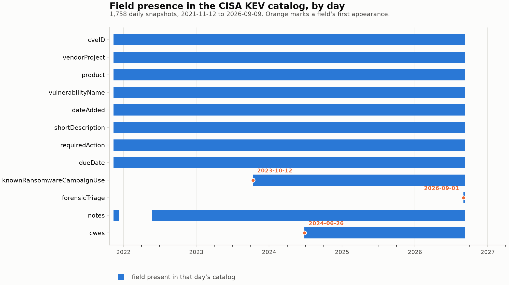
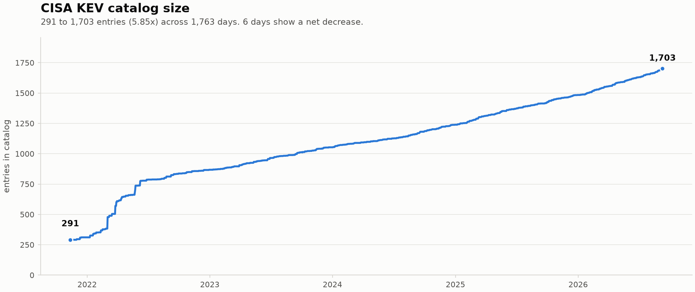

# Schema Evolution in the CISA Known Exploited Vulnerabilities Catalog, 2021–2026: A Three-Source Reconstruction

**Tosin Clement**
Independent Researcher
ORCID [0009-0001-2055-5113](https://orcid.org/0009-0001-2055-5113) · clementtosin92@gmail.com

*v0.1.0 · DOI [10.5281/zenodo.22699424](https://doi.org/10.5281/zenodo.22699424) · released 2026-09-11 · data cutoff 2026-09-09 · sources accessed 2026-09-11 · generated 2026-09-11T01:19:48Z*

---

## Abstract

The CISA Known Exploited Vulnerabilities (KEV) catalog is a widely consumed
input to vulnerability management, but CISA publishes no revision history for
it, so consumers have no authoritative record of when the shape of the data
changed. This report reconstructs that record. Using
1,758 daily catalog snapshots spanning 2021-11-12
to 2026-09-09 (1,763 days, 99.72%
calendar coverage), it identifies 6
schema-evolution events — 5 field-presence
transitions and 1
naming/canonicalization event — and cross-validates them against two additional
sources: CISA's official Git mirror and a second independent archive. Across
1,115 days carrying two or more captures the sources agree
99.91% of the time, with a single dated, explained exception.
Over the period the catalog grew from 291 to
1,703 entries (5.85×). The reconstruction,
its per-day evidence and its cross-source agreement record are released as
reusable data.

A supporting, time-sensitive finding is also reported. As of the
2026-09-09 data cutoff, with sources accessed 2026-09-11, the
field `forensicTriage` was present on 100.0% of
records in the live catalog but was not described in CISA's published JSON
schema, which had not been modified since its initial commit
590 days earlier. Because that schema does not restrict
additional properties, the catalog validates against it without error, so the
omission does not surface as a validation failure. This is a schema-documentation
gap, reported as observed on the stated dates; should CISA subsequently update
the schema, the dated observation remains accurate as a historical record.

## Executive summary

**Primary contribution — a three-source reconstruction of the KEV schema
timeline, 2021–2026.** CISA overwrites its catalog files in place and publishes
no changelog, so the history of the data's structure is not recoverable from the
canonical source. This report reconstructs it from 1,758
daily captures and corroborates it against two additional sources: CISA's
official Git mirror and a second independent archive.
6 schema-evolution events are identified and dated:
5 field-presence transitions and
1 naming/canonicalization event. Agreement across
1,115 multi-source days is 99.91%. This
finding is durable: it describes five years of history and does not depend on
the catalog's current state.

**Supporting finding — a schema-documentation gap, as of 2026-09-09.**
The `forensicTriage` field appeared in the catalog on
2026-09-01 and was present on
100.0% of records at the data cutoff. CISA's
published JSON schema did not describe it, and had one commit in its entire
history. The catalog nonetheless validates cleanly, so nothing signals the
omission to a consumer generating types or documentation from the schema. This
finding is explicitly time-bound and is reported with its observation dates
attached.

**On counting.** The two kinds of event are reported separately because they
are not the same thing. A field-presence transition changes which fields the
catalog carries. A naming/canonicalization event changes what the columns are
called without changing the set of logical fields — on 2021-12-01
every column was renamed. A reconstruction that tracks only field presence
cannot see the second kind, so a count of transitions alone understates the
history. All three figures are derived from the timeline, not stated by hand.

**Also documented.** Encoding and quoting churn in the published files, two
dated capture refusals at the content-delivery layer, entry withdrawals, and the
distinction between a capture's date and the catalog version it contains — the
one place in five years where that distinction changes an answer.

## 1. Why this record does not already exist

CISA distributes the KEV catalog as a single JSON file and a single CSV file,
each overwritten in place on every update. There is no version parameter, no
changelog, and no archive of prior states at the canonical URL. CISA's own
mirror repository states the problem directly: the KEV "has no inline file
revision history or log that's easily accessible after the fact."

The practical consequence is that a consumer who wrote a parser in 2022 has no
supported way to discover what changed underneath it. Schema changes are
observable only by having watched, daily, at the time. This report substitutes
for that missing history by reconstructing it from third-party daily captures.

## 2. Data and method

**Primary source.** An independent daily archiver has captured the KEV CSV once
per day since 2021-11-12, nine days after the catalog's launch. This
build reads 1,760 dated snapshot files, of which
1,758 are usable; 2 contain
markup rather than CSV and are excluded and reported rather than repaired.
Pinned at commit `3e428ceaa1e1`.

**Corroborating source 1.** CISA's own mirror, `cisagov/kev-data`, has published
the JSON, CSV, and the machine-readable JSON schema under git since
2025-01-27. It supplies 230 distinct days of
authoritative history and the schema file itself
(SHA-256 `577f4ccc06b7b7c6…`). Pinned at commit
`f6fafe2585c7`.

**Corroborating source 2.** A second archive, `https://github.com/lucagrippa/cisa-kev-archive.git`, has captured the KEV **JSON** daily from 2023-08-18 to 2026-09-10 (1,113 files, of which 1,112 are usable), extending corroboration more than a year earlier than CISA's own mirror begins. Pinned at commit `276aa25018e0`, accessed 2026-09-11.

Only that repository's `json/` tree is read, and it is excluded as a witness anywhere its evidence would be circular. Its `csv/` tree is not used at all. Hashing every date both repositories hold (1,753 dates) gives the complete picture: for all 668 dates before 2023-09-12 its CSV is byte-identical to the primary archive's and appears to be a back-filled copy, while 163 later shared-date files differ. The entire CSV tree is nonetheless excluded from independent corroboration, because the independently collected JSON series already represents this record keeper and counting both formats would duplicate one collector. The JSON is a second witness because the primary archive stored CSV only and never held these files. Per-date hashes are published in `data/raw/third_source_csv_identity.csv` so this exclusion can be re-derived rather than taken on trust.

That repository carries no licence file. Its archived content is the CISA catalog, a US government work released under CC0 by CISA, and this build reads that public-domain content for verification only. No file from the repository is copied into, redistributed by, or released with this project: the working clone lives in the git-ignored `sources/` directory, and only hashes, counts and dates are recorded here. This is a looser footing than the other two sources and is recorded as Limitation 12.

**Unit and measure.** The unit is the (snapshot date, field name) pair. A field
is *present* on a date if it appears in that day's CSV header or, on the JSON
track, in any record's keys. A *change event* is a transition in presence
between consecutive available dates.

**Name harmonisation.** The catalog renamed its columns from human-readable
labels (`CVE`, `Vendor/Project`) to camelCase (`cveID`, `vendorProject`) on
2021-12-01. Both spellings denote the same logical field, so presence
is reported on canonical names and the rename is recorded as its own event
rather than as eight simultaneous removals and eight additions.

**Cross-validation.** 1,115 days carry captures from two or more sources, 223 of them from all three. The derived field sets agree on 1,114 of those days (99.91%).

The single exception is instructive rather than troubling. On 2026-09-01 the second archive records no `forensicTriage` while the other two do — because it captured `catalogVersion` 2026.08.31, the previous day's catalog, having fetched before CISA published that day. Keyed on `catalogVersion` instead of capture date, all three sources agree exactly: `forensicTriage` is absent from v2026.08.31 and present in v2026.09.01. Capture date is not catalog version, and this is the one place in five years of history where the distinction changes an answer. The timeline is reported on capture date throughout, so this date is stated with that caveat attached.

Events before 2023-08-18 remain corroborated by a single source; see Limitation 4.

## 3. Primary contribution: the reconstructed schema timeline

| Date | Event | Field | Evidence |
|---|---|---|---|
| 2021-12-01 | naming convention change | `(all fields)` | label_case -> camel_case; example: CVE -> cveID |
| 2021-12-11 | field removed | `notes` | present on 2021-12-10 |
| 2022-05-24 | field restored | `notes` | absent on 2022-05-23 |
| 2023-10-12 | field added | `knownRansomwareCampaignUse` | absent on 2023-10-11 |
| 2024-06-26 | field added | `cwes` | absent on 2024-06-25 |
| 2026-09-01 | field added | `forensicTriage` | absent on 2026-08-31 |

Read together with Figure 1, the picture is of a schema that is stable in its
core and additive at its edges. Nine logical fields were present at launch: the
eight core fields `cveID` through `dueDate`, plus `notes`. The eight core fields
are present on every one of the 1,758 usable snapshot days
and are the eight the published schema marks as required. `notes` is not among
them, having been withdrawn and later reinstated (below). Across the period the pipeline identifies
6 schema-evolution events:
5 field-presence transitions, in which a field
appears or disappears, and 1
naming/canonicalization event, in which every column was renamed on
2021-12-01 without the set of logical fields changing. The
two are counted separately throughout: presence tracking alone cannot detect a
rename, since this build harmonises the two spellings precisely so that presence
stays comparable across it. Of the transitions, every one is an addition except
a single removal and its later restoration.

**`notes`** was present at launch, was removed on 2021-12-11, and was
reinstated on 2022-05-24 — absent for 164
consecutive observed days. Both boundary days also carried new catalog entries
(13 and 20 respectively),
indicating a fresh publication rather than a stale or failed capture, and the
field returned unpopulated (0 of
703 records, against
15 of 296
immediately before removal), consistent with a column reinstated structurally
before being filled. It is the only field in the catalog's history to have been
withdrawn and reinstated. No independent source covers this period; see
Limitation 4.

**`knownRansomwareCampaignUse`** appeared on
2023-10-12 and has been present on every
snapshot since.

**`cwes`** appeared on 2024-06-26, adding the catalog's only
nested structure: an array of CWE identifiers rather than a scalar. This is the
change most likely to have broken a naive CSV-to-JSON consumer, because the
column's value is a list rendered into a single CSV cell.

**`forensicTriage`** appeared on 2026-09-01 and is
present on 9 snapshot days as of
2026-09-09. The primary CSV archive and CISA's official Git mirror both first
show it on that capture date, and neither holds it on the preceding day. The
second independent archive does **not** show it on that capture date: it fetched
before CISA published that day, so its capture holds the previous catalog
version. Compared by `catalogVersion` rather than by capture date, all three
agree — the field is absent from v2026.08.31 and present in v2026.09.01. The
three sources therefore agree on the catalog version in which the field first
appears, not on a single capture day.



**Figure 1.** Field presence by day across 1,758 daily
snapshots. The gap in `notes` and the late, narrow band for `forensicTriage`
are the two discontinuities in an otherwise additive history.



**Figure 2.** Catalog size over the same period, 291 to
1,703 entries. Growth is close to linear after the initial
2022 expansion. 6 days show a net decrease,
corresponding to withdrawn entries.

## 4. Supporting finding: a schema-documentation gap, as of 2026-09-09

CISA publishes a machine-readable JSON schema alongside the catalog and states
in the mirror's README that it "will also remain in sync" with the data. This
section reports what the schema described at a specific moment. Every statement
in it is bounded by the 2026-09-09 data cutoff, with the schema file and
live catalog accessed 2026-09-11.

At that date the schema described 11 record fields and
the catalog contained 12. The undescribed field was
`forensicTriage`, present on 100.0% of the
1,703 records in the catalog, and first observed in the catalog
on 2026-09-01 —
8 days before the data cutoff.

The schema file had **1 commit in its entire history**,
dated 2025-01-27, 590 days before the
data cutoff. It had not been amended.

The omission does not surface as an error, which is the substance of the
finding. The schema declares `http://json-schema.org/draft-07/schema#` and does not set
`additionalProperties`, which under JSON Schema defaults to permissive.
Validating the catalog as of 2026-09-09 against the schema as of
2026-09-11 produces **0 errors**. The data is
well formed and the schema is not violated. What the schema does not do is
describe the field: a consumer generating types, database columns, or
documentation from it receives no `forensicTriage` and receives no error either,
so the field is silently omitted downstream.

This is a documentation gap rather than a validation failure, and it is harder
to notice for that reason. A validation failure surfaces in continuous
integration. An omission from a permissive schema surfaces when someone
eventually asks why a column is missing.

Two limits on this finding should be read with it. First, the semantics of
`forensicTriage` — its meaning, permitted values and intended use — are not
documented in any source consulted, so this report does not characterise the
field, only its presence. Second, the finding is a dated observation, not a
standing claim: it records the state of the published schema as of
2026-09-11. If CISA subsequently describes the field, that does not
falsify this section; it closes the gap the section documents, and the
observation stands as a historical record of the interval.

## 5. Data-quality artefacts in the archival record

24 artefacts were catalogued. They matter because anyone
reconstructing this history from the same public sources will encounter them,
and because two of them could be mistaken for schema changes.

- **Capture failures (2 days).** On 2024-11-26 and 2024-11-27 the archiver stored an Akamai edge "Access Denied" response rather than CSV. The embedded reference identifiers decode to 18:11:11 UTC and 18:11:07 UTC respectively — 23.999 hours apart, consistent with a scheduled daily job that ran normally and was refused at the content-delivery layer. Adjacent days retrieved valid data. The second archive independently confirms this: its own capture for 2024-11-26 is also an Akamai edge denial, timestamped 23:32:48 UTC, for the JSON endpoint rather than the CSV one. Two unrelated collectors, two different URLs, refused within hours of each other. The responses record a refusal at the content-delivery layer rather than an unavailable catalog or a fault in the collection tool. They do not record why the requests were refused, and no cause is inferred here. These days are excluded, not interpolated.

- **Encoding and quoting churn.** A UTF-8 BOM appears and disappears, and header
  quoting toggles, across several dates. These change the bytes of the file
  without changing the schema. A reconstruction that keys on the raw header
  string rather than on parsed field names will read these as spurious schema
  events; this build parses the header and does not.
- **Coverage gaps (4).** Isolated missing days, the longest
  being the two-day capture failure above.
- **Record withdrawals (6 days).** Days on which the
  entry count fell. These are genuine removals by CISA, not parsing errors.

## 6. What this does and does not establish

It establishes when each field first and last appears **in the daily captures**,
which is a close but not identical proxy for when CISA changed the catalog. A
change made and reverted between two captures is invisible here. Sub-daily
resolution is not available for the 2021–2024 period from any public source
known to the author.

It does not establish *why* any change was made. No CISA announcement is cited
for any of the 5 field-presence transitions or
for the 1 naming/canonicalization event,
because the author found none tied to them; the
absence of an announcement is part of what makes a reconstructed timeline
necessary.

It does not establish the semantics of `forensicTriage`. The field's meaning,
permitted values, and intended use were undocumented in every source consulted
as of 2026-09-11, which is the practical cost of the gap described in
Section 4.

## 7. Conclusion

The durable contribution of this work is the reconstruction. CISA distributes
the KEV catalog by overwriting it in place, so the record of how its structure
changed does not exist at the canonical source. This report supplies that record
for 2021-11-12 to 2026-09-09:
6 schema-evolution events —
5 field-presence transitions and
1 naming/canonicalization event — drawn
from 1,758 daily captures and corroborated across
1,115 multi-source days at 99.91%
agreement, with the per-day evidence, the cross-source agreement record and the
exclusion decisions all published so the reconstruction can be re-derived rather
than trusted. That reconstruction is reproducible and explicitly bounded by the
available archival coverage; it does not depend on the catalog's present
state.

The schema-documentation gap reported in Section 4 is a supporting observation
with an explicit expiry. As of 2026-09-11 the published schema described
11 of the catalog's 12 fields, and
the omitted field was present on 100.0% of
records. Because the schema is permissive, nothing signals the omission to an
automated consumer. Whether CISA closes that gap tomorrow or leaves it open,
the observation is dated and remains accurate as a record of the interval.

Both findings point at the same underlying condition: a widely relied-upon
public dataset is distributed without a revision history, and its published
description is not versioned alongside it. The reconstruction shows what that
costs a consumer trying to understand the data's past; the schema gap shows what
it costs one trying to parse its present.

## 8. Reproducing this

The repository accompanying this report contains the pipeline, the pinned source
commits, the derived tables, and the QA report. From a clean checkout:

```bash
python -m venv venv
venv/bin/pip install -r requirements.lock
bash code/run_all.sh
```

`run_all.sh` runs every stage in order. Individually:

```bash
code/01_fetch.py        # clone all three sources, at pinned commits
code/02_build.py        # reconstruct the timeline
code/03_qa.py           # QA report - read before trusting any output
code/04_figures.py      # stats.json and the figures
code/00_metadata.py     # CITATION.cff
code/07_release_notes.py  # release notes, from the statistics
code/08_render_docs.py  # README and LIMITATIONS, from templates
code/09_snapshot_links.py # verifiable links to each snapshot
code/05_document.py     # this report
code/build_pdf.sh       # the PDF
```

Because all three sources are pinned to commits, and every Python dependency is
pinned in `requirements.lock` (the validated environment is recorded in
`docs/ENVIRONMENT.md`), the pipeline reproduces these exact numbers — and, under
those pinned dependencies, byte-identical figures — indefinitely. Running
`01_fetch.py --update-pins` moves to current HEAD, after which every number in
this report must be regenerated and re-verified.

## Data availability

All inputs are public. The KEV catalog and its schema are distributed by CISA
under CC0 via `https://github.com/cisagov/kev-data.git`. The daily archive is
`https://github.com/hrbrmstr/cisa-known-exploited-vulns.git` and `https://github.com/lucagrippa/cisa-kev-archive.git`.

The derived tables in this repository — the reconstruction and its supporting
evidence — are released under CC BY 4.0, as are this report and its figures; the
code is MIT. That licence applies to the original selection, arrangement,
reconstruction, annotation and documentation contributed here, to the extent
those elements are legally protectable; where no such rights subsist, none are
asserted. It does not restrict the underlying CISA catalog, which is a United
States government work released under CC0 by CISA and remains public-domain
material, nor any third-party content. Facts about the catalog are not owned by
this project. Attribution is required of anyone relying on rights the licence
covers; it is a condition of reuse, not a means of detecting it. The full rights
statement is in `LICENSE-DATA`.

## AI assistance

AI tooling assisted with source discovery, code authoring, data processing,
quality assurance, and drafting. The author selected the research question,
ruled on the substantive judgment calls, manually verified the reported
schema-change boundaries and live-source observations, reviewed the final
report, and accepts responsibility for its content.
